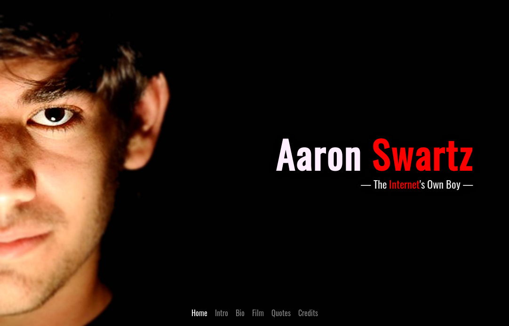

# Tribute to Aaron Swartz
#### Project made for the "Responsive Web Design" module in freeCodeCamp 
---

This is a little tribute page to Aaron Swartz that I made for freeCodeCamp. I used Bootstrap SCSS mostly and also Vanilla Javascript instead of jQuery and Bootstrap's libraries.

#### Screenshot

#### Try it out!

If you want to see it live, open [this pen](https://codepen.io/yagoestevez/full/aaaOxL) on Codepen.

#### User Stories

These are the requirements for this project. They are all fullfilled.

1. My tribute page should have an element with a corresponding id="main", which contains all other elements.
2. I should see an element with a corresponding id="title", which contains a string (i.e. text) that describes the subject of the tribute page (e.g. "Dr. Norman Borlaug").
3. I should see a div element with a corresponding id="img-div".
4. Within the img-div element, I should see an img element with a corresponding id="image".
5. Within the img-div element, I should see an element with a corresponding id="img-caption" that contains textual content describing the image shown in img-div.
6. I should see an element with a corresponding id="tribute-info", which contains textual content describing the subject of the tribute page.
7. I should see an a element with a corresponding id="tribute-link", which links to an outside site that contains additional information about the subject of the tribute page. HINT: You must give your element an attribute of target and set it to _blank in order for your link to open in a new tab (i.e. target="_blank").
8. The img element should responsively resize, relative to the width of its parent element, without exceeding its original size.
9. The img element should be centered within its parent element.

---

[Yago Estévez](https://twitter.com/yagoestevez)
